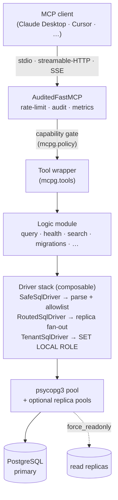

# MCPg Architecture

How MCPg is built. Describes the current shape; the running record
of how it got there lives in [`../CHANGELOG.md`](../CHANGELOG.md)
and the [`adr/`](adr/) directory.

---

## Overview

MCPg is a single-process, async ([`asyncio`](https://docs.python.org/3/library/asyncio.html))
MCP server. An MCP client connects via stdio or HTTP, calls tools,
and gets typed results. Every call passes through the same layers:

> The Mermaid diagram renders on GitHub; on the docs site it shows as
> source. In words: the tool wrapper translates the MCP call into a
> typed Python call and enforces the capability gate, the logic module
> builds and runs the SQL, and the composable driver stack validates /
> forces read-only / picks a pool / sets the tenant role before the
> psycopg3 pool reaches PostgreSQL.

---

## Request lifecycle

1. The client invokes a tool. `AuditedFastMCP.call_tool` (a
   `FastMCP[AppContext]` subclass) wraps every invocation:
   - Checks the rate limiter (`mcpg.middleware.rate_limit`) when
     `MCPG_RATE_LIMIT_ENABLED=true`.
   - Records an audit event on completion (success or failure)
     with the tool name, redacted arguments, and outcome.
   - Updates the Prometheus counter + histogram
     (`mcpg_tool_calls_total{tool,status}` /
     `mcpg_tool_duration_seconds`).
2. The tool wrapper in `mcpg.tools` pulls the request's
   `AppContext` (settings + database + listen manager + cursor
   manager) from the server lifespan and obtains a `SqlDriver`.
3. The wrapper delegates to a **logic module** that builds and
   runs the SQL and maps rows to typed dataclasses.
4. The driver stack decides exactly which pool the SQL hits:
   - **SafeSqlDriver** — agent-supplied SQL is parsed and
     allowlisted via `mcpg.sql` (the first-party kernel) before execution.
   - **RoutedSqlDriver** — when `MCPG_REPLICA_URLS` is set,
     `force_readonly=True` queries round-robin across healthy
     replicas; writes always go to the primary.
   - **TenantSqlDriver** — wraps a base driver to issue
     `BEGIN ... SET LOCAL ROLE "<role>" ... <stmt> ... COMMIT`
     when a static or per-request role is in play.
5. The result is mapped to a typed result class and returned
   through the tool wrapper. The audit hook records the outcome.

---

<!-- BEGIN generated: module-map (python tools/generate_doc_tables.py --modules) -->
## Module map (103 modules)

Every `mcpg.*` module and what it owns, alphabetical. The layered
request path through these lives in the [Overview](#overview) diagram;
this table is the exhaustive index. Regenerate with
`python tools/generate_doc_tables.py --modules`.

| Module | Responsibility |
|---|---|
| `mcpg.about` | MCPg self-description. |
| `mcpg.advisors` | Schema advisors — codified lint rules over the PG catalog. |
| `mcpg.aio` | `AIO` — PG 19 asynchronous-I/O subsystem coverage. |
| `mcpg.audit` | Audit logging of tool invocations and DBA database performance checks. |
| `mcpg.audit_integrity` | Audit trail verification utility. |
| `mcpg.audit_nl2sql` | NL→SQL audit table — partitioned, compressed, RLS-gated. |
| `mcpg.audit_trail` | SQL audit trail with optional persistence to `mcpg_audit.events`. |
| `mcpg.autovacuum` | Autovacuum priority advisor — `read_autovacuum_priority`. |
| `mcpg.cache` | Thread-safe, async-safe caching manager for PostgreSQL introspections and summaries. |
| `mcpg.composite` | Composite tools — agent UX wins built on top of existing primitives. |
| `mcpg.config` | Env-driven, validated `Settings` (frozen dataclass); redacts secrets in `__repr__`. |
| `mcpg.config_advisor` | Configuration & sizing advisors — pghero / pgtune coverage. |
| `mcpg.context` | `AppContext` — per-server state (settings, DB, cursor/listen managers) shared with tool wrappers. |
| `mcpg.cron` | pg_cron job-scheduling wrappers. |
| `mcpg.cursors` | Server-side cursor manager — pageable reads of large result sets. |
| `mcpg.cypher` | Apache AGE Cypher Query Execution. |
| `mcpg.data_movement` | Data-movement tools — exports, dumps, restores, and bulk imports. |
| `mcpg.database` | Database connection lifecycle for the MCPg server. |
| `mcpg.ddl_dryrun` | Transactional DDL dry-run — roadmap 2.8. |
| `mcpg.demo` | The `mcpg --demo` dataset — a curated playground schema. |
| `mcpg.diagrams` | Schema-visualisation helpers. |
| `mcpg.diesel` | Schema → Diesel ORM (Rust) exporter. |
| `mcpg.drizzle` | Schema → Drizzle ORM (TypeScript) exporter. |
| `mcpg.ecto` | Schema → Ecto (Elixir) schema exporter. |
| `mcpg.ent` | Schema → Ent (Go) schema exporter. |
| `mcpg.extensions` | PostgreSQL extension management. |
| `mcpg.graph` | Apache AGE Graph Introspection and Parsing. |
| `mcpg.graph_diagram` | Apache AGE Graph Schema Visualisation. |
| `mcpg.graph_mgmt` | Apache AGE Graph Management. |
| `mcpg.graph_projection` | Relational → Apache AGE graph projection generator (emit-don't-execute). |
| `mcpg.headline_curator` | Dynamic `headline_tools` recommender — empirical curation from the audit log. |
| `mcpg.health` | Database health checks. |
| `mcpg.http_runtime` | HTTP-transport extensions: bearer-token auth + Prometheus /metrics. |
| `mcpg.indexing` | Index recommendations from table scan statistics and column types. |
| `mcpg.introspection` | Schema-introspection queries against the PostgreSQL catalog. |
| `mcpg.io_stats` | I/O stats reader — wraps `pg_stat_io` (PostgreSQL 16+). |
| `mcpg.jooq` | Schema → jOOQ (Java) configuration exporter. |
| `mcpg.listen` | LISTEN/NOTIFY bridge — tool-poll model per ADR-0005. |
| `mcpg.liveops` | Live-operations introspection: in-flight queries, waits, and blocking. |
| `mcpg.locks` | Lock-inspection helpers — `list_locks` and `find_blocking_chains`. |
| `mcpg.logical_replication` | Logical replication management writes. |
| `mcpg.maintenance` | Maintenance operations: gated VACUUM and ANALYZE. |
| `mcpg.middleware.rate_limit` | Async-safe Token Bucket Rate Limiter for MCPg tool execution. |
| `mcpg.migration_history` | PostgreSQL migration history table reader. |
| `mcpg.migration_ingestion` | Migration-script ingestion — list pending Alembic / Flyway / Liquibase migrations. |
| `mcpg.migrations` | Staged-migration workflow — Batch F / Phase 27 per ADR-0006. |
| `mcpg.multidb` | Multi-database selector — named, read-only secondary databases (roadmap 13.1). |
| `mcpg.naming` | Naming-convention linter — catch inconsistencies in table / column / index names. |
| `mcpg.nl2sql` | Natural-language → SQL helper. |
| `mcpg.obs_logging` | Observability Logging — Structured JSON logging and setup for MCPg loggers. |
| `mcpg.observability` | Observability — Prometheus-format metrics for tool calls. |
| `mcpg.oidc` | OIDC / JWT bearer-token validation for the HTTP transport. |
| `mcpg.otel_tracing` | OpenTelemetry tracing — one span per MCP tool call. |
| `mcpg.partman` | pg_partman partition-management wrappers. |
| `mcpg.pg19_ddl` | PG 19 DDL helpers — `validate_check_constraint` + `pg_get_*def()` family. |
| `mcpg.pg19_partitions` | PG 19 partition reorganisation — `MERGE PARTITIONS` + `SPLIT PARTITION`. |
| `mcpg.pg19_runtime` | PG 19 runtime toggles — online data checksums + on-demand logical replication. |
| `mcpg.pg19_skip_scan` | PG 19 skip-scan-aware index advisor — `recommend_skip_scan_indexes`. |
| `mcpg.pg19_stats` | PG 19 lock + recovery analytics — `pg_stat_lock` and `pg_stat_recovery`. |
| `mcpg.pg_prewarm` | `pg_prewarm` coverage — extension status, buffer-cache reads, advisor, autowarm. |
| `mcpg.pg_search` | pg_search integration: full BM25 surface (phases BM-1 through BM-5). |
| `mcpg.pgq` | SQL/PGQ — property graph queries (PG 19 standard) coverage. |
| `mcpg.pitr` | Point-in-time-recovery readiness advisor. |
| `mcpg.policy` | Access-mode policy: which tool capabilities each access mode permits. |
| `mcpg.prisma` | PostgreSQL → Prisma schema exporter. |
| `mcpg.prompts` | MCP prompts — pre-built interrogation playbooks for common DBA tasks. |
| `mcpg.query` | Safe read-only query execution. |
| `mcpg.rag_efficiency` | RAG efficiency suite — Phase A. |
| `mcpg.rag_telemetry` | RAG telemetry — Phase C of the RAG efficiency suite. |
| `mcpg.redis_fdw` | `redis_fdw` coverage — catalog filters, DDL helpers, cache stats, advisor. |
| `mcpg.repack` | `REPACK` — PG 19 in-server online table rebuild. |
| `mcpg.replicas` | Read-replica routing — distribute read-only queries across replicas. |
| `mcpg.resources` | MCP resources — preload-on-connect surface (`mcpg://…`). |
| `mcpg.rls` | Row-Level Security tester — see what an RLS-bound role would read. |
| `mcpg.schema_diff` | Structural schema diff powering `compare_schemas`. |
| `mcpg.schema_docs` | Schema documentation generator. |
| `mcpg.secrets` | Pluggable secrets backend. |
| `mcpg.server` | MCP server bootstrap for MCPg. |
| `mcpg.session_advisor` | Session-scope cost advisor — reads `mcpg_audit.events` and surfaces hot-path inefficiencies before they cost real tokens. |
| `mcpg.session_intent` | Session-intent handshake — narrow the tool surface to a stated goal. |
| `mcpg.shell` | Subprocess execution policy for shell-gated tools (ADR-0004). |
| `mcpg.sql.allowlist` | SQL-safety **policy** for the first-party kernel — the allowlist, as data. |
| `mcpg.sql.driver` | PostgreSQL connection pool + query driver — first-party SQL kernel. |
| `mcpg.sql.safety` | SQL-safety **mechanism** — parse a query and walk it against the allowlist. |
| `mcpg.sqlalchemy_export` | Schema → SQLAlchemy 2.0 declarative models exporter. |
| `mcpg.sqlc` | Schema → sqlc-friendly SQL DDL exporter. |
| `mcpg.tenancy` | Per-request PostgreSQL role multi-tenancy. |
| `mcpg.test_data` | Synthetic test-data factory. |
| `mcpg.test_row_factory` | Realistic single-row factory — one row per call, catalogue-aware. |
| `mcpg.textsearch` | Search tools: trigram fuzzy, full-text, pgvector k-NN, and PostGIS geo. |
| `mcpg.timescaledb` | TimescaleDB hypertable + compression + retention helpers. |
| `mcpg.tool_introspection` | Per-tool introspection — payload for the `describe_tool` MCP tool. |
| `mcpg.tools` | MCP tool definitions for MCPg. |
| `mcpg.turboquant` | pg_turboquant integration: observability + advisor + write + DDL + query. |
| `mcpg.vector_ops` | pgvector analytics — heuristics on top of stored embeddings. |
| `mcpg.vector_tuner_advanced` | Advanced pgvector tuning diagnostics. |
| `mcpg.vector_tuning` | pgvector index-tuning advisors. |
| `mcpg.wait_for_lsn` | PG 19 `WAIT FOR LSN` — read-your-writes (RYW) consistency on hot standbys. |
| `mcpg.wal_archive` | WAL archive inspection — `pg_stat_archiver` + archive configuration. |
| `mcpg.walinspect` | PostgreSQL pg_walinspect extension reader. |
| `mcpg.warehousepg` | WarehousePG (Greenplum-derived MPP) integration. |
| `mcpg.workload` | Workload analysis via the `pg_stat_statements` extension. |
| `mcpg.write` | Write execution: gated DML (and, in `write_ddl`, DDL). |
<!-- END generated: module-map -->

`mcpg.__main__` is the `mcpg` console entry point; handles the
`--version` flag and falls through to `run(load_settings())`.

---

## The SQL-safety kernel (first-party)

`src/mcpg/sql/` is MCPg's own SQL-safety kernel, split into policy
and mechanism:

- `sql/allowlist.py` — the permitted statement / `pglast` AST node /
  function / extension sets, **as data** (the single auditable policy
  surface).
- `sql/safety.py` — `SafeSqlDriver`: the `pglast` parse + AST-walker
  + read-only execute path. Reads policy from `allowlist.py`; the
  walker can't widen it.
- `sql/driver.py` — `SqlDriver` / `DbConnPool` / `obfuscate_password`
  (pool + execution + credential redaction; no policy).

It's fully inside the coverage gate + `mypy --strict` + `ruff` +
`bandit`. Adversarial + fuzz tests live in
`tests/unit/test_sql_kernel_*.py`; the threat model and security
sign-off are in
[`reviews/devendor-sql-kernel-security-review.md`](reviews/devendor-sql-kernel-security-review.md).
It was de-vendored from `crystaldba/postgres-mcp` (MIT) — see
[ADR-0007](adr/0007-first-party-sql-kernel.md), which supersedes
[ADR-0001](adr/0001-build-approach.md).

---

## Access-mode & capability model

`mcpg.policy` maps each access mode to a set of capabilities:

| Access mode | Capabilities granted |
|---|---|
| `read-only` | `READ` |
| `restricted` | `READ`, `WRITE` |
| `unrestricted` | `READ`, `WRITE`, `DDL`, `SHELL`, `LISTEN`, `MIGRATE` |

`restricted` is the "safe read-write" tier — data writes (DML) but no
schema changes, subprocess, LISTEN/NOTIFY, or migrations.

The higher-blast-radius capabilities that `unrestricted` grants
(`DDL`, `SHELL`, `LISTEN`, `MIGRATE`) **additionally** require their
per-feature opt-in gate — enforced where tools register, not in the
policy table:

| Env var | Capability |
|---|---|
| `MCPG_ALLOW_DDL=true` | `DDL` (and `MIGRATE`, which piggybacks on it) |
| `MCPG_ALLOW_SHELL=true` | `SHELL` |
| `MCPG_ALLOW_LISTEN=true` | `LISTEN` |

`register_tools` consults the policy so a tool is only exposed to
the MCP client when its required capability is permitted. There is
**no module-level mutable state** — settings, the database, the
listen manager, and the cursor manager all live in the server
lifespan's `AppContext`, passed to tools via `Context.lifespan_context`.

---

## Transport & HTTP middleware stack

For `MCPG_TRANSPORT=streamable-http` or `sse`, `mcpg.http_runtime`
constructs a Starlette app with this middleware stack (outermost
first):

1. **Bearer / OIDC authentication.** Static
   (`MCPG_HTTP_AUTH_TOKEN` constant-time compare) or full JWT
   validation against an OIDC issuer's JWKS. `/metrics` / `/healthz`
   / `/readyz` are exempt by design.
2. **Per-request role propagation.** Reads `X-MCPG-Role` (or the
   OIDC role claim when `MCPG_OIDC_ROLE_CLAIM` is set), validates
   against `MCPG_ALLOWED_ROLES`, and stashes the value in the
   `current_role` ContextVar that the `TenantSqlDriver` reads.
3. **The MCP transport handler** (FastMCP-provided).

Plus three first-party endpoints under the same auth-exempt rules:

- `GET /metrics` — Prometheus text format
- `GET /healthz` — liveness
- `GET /readyz` — readiness (verifies a pool connection)

---

## Security model (summary)

Read-only by default; every agent-supplied SQL statement is parsed
and allowlist-checked before execution; writes are validated as a
single statement of an expected kind; identifiers everywhere flow
through a `[A-Za-z_][A-Za-z0-9_]*` regex; credentials are redacted
from logs and audit trail; PG TLS is enforced on startup; HTTP
transports require a bearer token or OIDC JWT; per-session
`statement_timeout` and `lock_timeout` are set on each pool
checkout. The full threat model is in [`security.md`](security.md);
the shipped-vs-queued roadmap is in
[`security-hardening.md`](security-hardening.md).

---

## Graceful degradation for optional extensions

Tools that depend on an optional extension check for it at call
time and return an `available: false` result instead of failing
when it's absent. Affected tools:

| Tool | Required extension |
|---|---|
| `fuzzy_search` | `pg_trgm` |
| `analyze_workload`, `detect_n_plus_one` | `pg_stat_statements` |
| `vector_search`, `vector_range_search`, `hybrid_search`, `recommend_vector_*`, `analyze_vector_*` | `vector` (pgvector) |
| `geo_search` | `postgis` |
| `pg_cron.*` | `pg_cron` |
| `partman.*` | `pg_partman` |
| `list_hypertables`, `create_hypertable`, `add_compression_policy`, `add_retention_policy`, `list_chunks` | `timescaledb` |
| `list_graphs`, `describe_graph`, `run_cypher`, `create_graph`, `drop_graph`, `generate_graph_diagram` | `age` (Apache AGE) |

`describe_table` and `list_indexes` surface `pgvector` /
index-method details when present without requiring the extension
otherwise.

---

## Testing approach

MCPg is test-driven across three suites:

| Suite | Scope |
|---|---|
| `tests/unit/` | Fake-driver tests with a 90% coverage gate — all first-party code, including the SQL-safety kernel (`test_sql_kernel_*.py`: the adversarial allowlist suite + a fuzz/robustness pass). |
| `tests/integration/` | Real PostgreSQL — requires `MCPG_TEST_DATABASE_URL`. CI runs the matrix against PostgreSQL 14, 15, 16, 17, 18 on every push (pgvector + PostGIS + AGE image), plus an **experimental PG 19** lane (pgvector built from source against `postgres:19beta1`) and a **WarehousePG** (Greenplum-derived MPP) characterisation lane. |
| `tests/contract/` | Tool-surface snapshot (`tool_surface.snapshot.json`) + the doc-table drift-guard (`test_doc_tables.py`), so a new tool or module can't ship undocumented. |

The integration container is built from
`.github/ci-postgres.Dockerfile` and includes `pgvector`,
`postgis`, `pg_trgm`, `pg_stat_statements`, and Apache `age`.

---

## Configuration & deployment

Configuration is **entirely** environment-variable driven — no
config file, no flags beyond `--version`. The full env-var
reference is in the [README](../README.md#configuration); the
narrative is in [`installation.md`](installation.md).

MCPg ships as both a PyPI package (`pip install mcpg`) and a
hardened multi-stage Docker image — the runtime stage drops the
build toolchain, runs as `uid=10001 / gid=10001` with `nologin`,
and keeps application files root-owned and read-only.

Scaling characteristics, pool sizing, and observability guidance
live in [`scaling.md`](scaling.md).

---

## See also

- [`adr/`](adr/) — accepted architecture decision records.
- [`tour.md`](tour.md) — tool discovery surface, grouped by
  intent.
- [`tools.md`](tools.md) — full per-tool reference.
- [`security.md`](security.md) — threat model.
- [`security-hardening.md`](security-hardening.md) — shipped vs
  queued hardening roadmap.
- [`scaling.md`](scaling.md) — load behaviour and tuning.
- [`release-process.md`](release-process.md) — release playbook.
